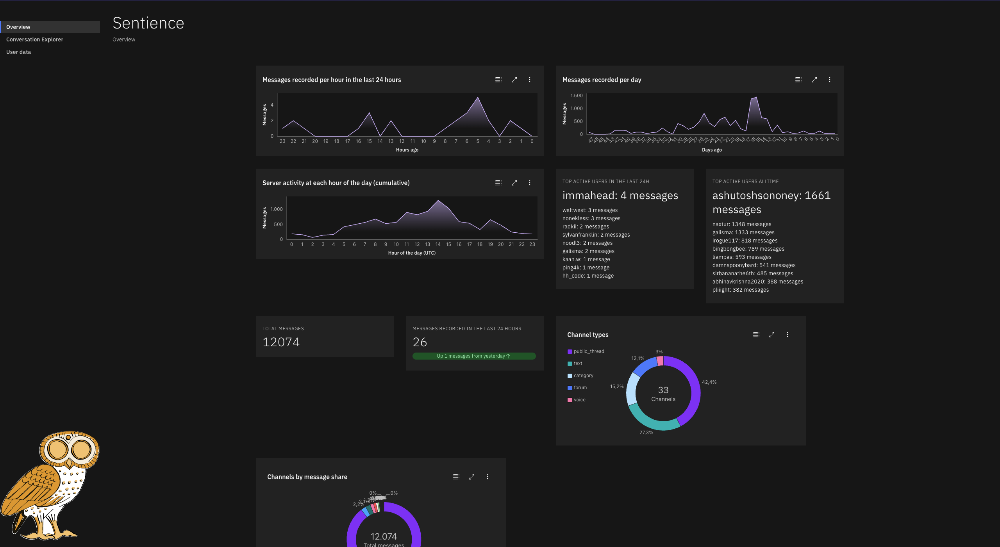

# Sentience dashboard

This is the dashboard used to display all information gathered by the sentience bot. It uses SvelteKit and the IBM carbon components for Svelte as well as the carbon charts for svelte library. It also holds a conversation explorer page with data on all recorded messages and highlights them into topics (classified by `topic-sorter`) and a User data page with facts the the `fact-extractor` worker has extracted about users.

## Installation

It is dockerized, however not included in the docker-compose with the main sentience workers, as it lives in a different repository.

## Contribution

Please refer to the guide in the main sentience-workers repository.
